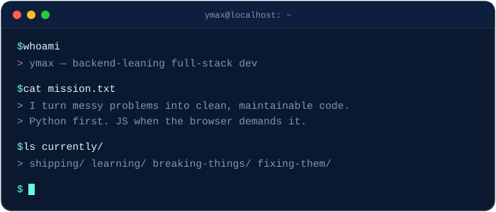

# There's no place like `127.0.0.1`

 

 

### Stack

 

 

 

### Currently & done building

<table align="center">
<tr>
<td width="50%">

**→ [Open To All](https://github.com/ymax27/opentoall)**
Plateforme de découverte et de valorisation de la contribution open source.
`Django` `Redis` `PostgreSQL` `Cron-job`

</td>
<td width="50%">

**→ [ShopHub Marketplace](https://github.com/ymax27/ShopHub---MarketPlace)**
Publier des articles, de gérer leur inventaire et de communiquer en temps réel via une messagerie intégrée.
`Django` `Sqlite3` `Pillow`

</td>
</tr>
</table>

 

### Stats

 

### Connect

  

